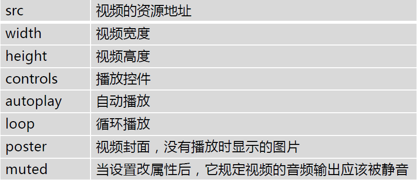
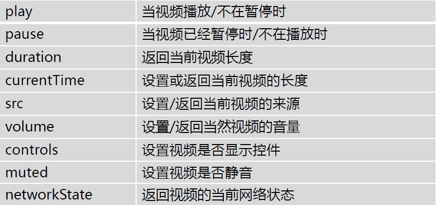
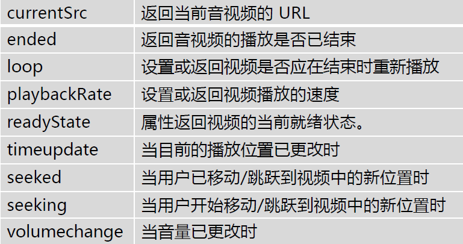
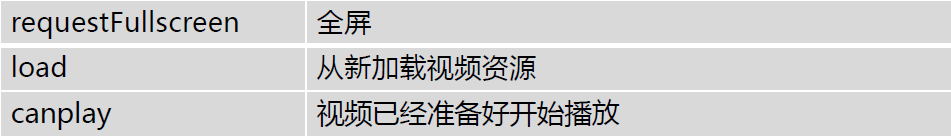

# 视频

### 认识 video

- video 标签定义视频
- 支持的视频格式：
  - MP4：MPEG 4 文件使用 H264 视频编解码器和 AAC 音频编解码器
  - WebM：WebM 文件使用 VP8 视频编解码器和 Vorbis 音频编解码器
  - Ogg：Ogg 文件使用 Theora 视频编解码器和 Vorbis 音频编解码器
- 各个浏览器中的差异

### video 属性

### video 的 API 事件

