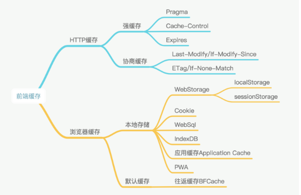

# 前端缓存

1. 强缓存：在以下 2 个时间之前/以内，都不会发送请求，直接使用缓存。以相对时间为基准

   - 过期时间（服务器的绝对时间）：`Expires: Sun, 02 Jun 2019 10:44:37 GMT`
   - 相对时间：`Cache-Control: max-age=30` 这个指 30 秒

2. 协商缓存：问一下服务器能不能直接用
   - `Last-Modified: Wed, 19 Apr 2017 16:05:19 GMT`
   - `If-Modified-Since`
   - `Etag`
   - `If-None-Match`
