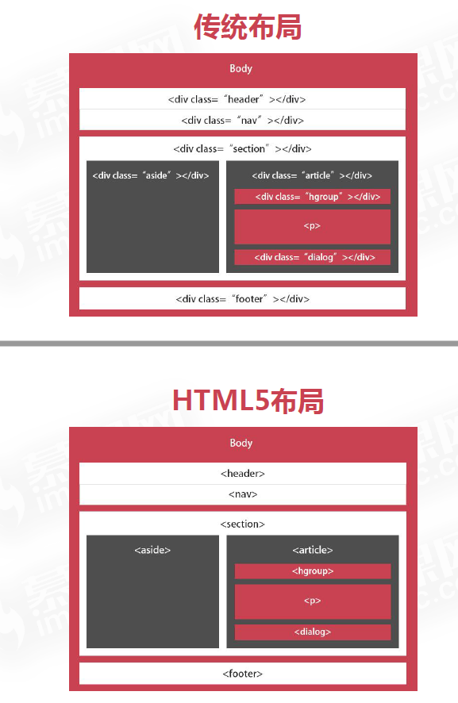

# 布局类元素

> 遵循语义化，有利于 SEO
>
> PS：可以先用 div，然后再换成以下新标签

- header：页头
- section：定义一个区域
  - nav：导航
  - article：一块独立的内容，如文章、评论
  - aside：侧栏
  - hgroup：定义文件中一个区块的相关信息，如 h1~h6 标签组
  - figure：定义一组多媒体内容
    - figcaption：figure 元素的标题
  - dialog：定义一个对话框，类似微信
- footer：页脚

---

> 当不知道怎么分类时，才使用：

- div：最常用的容器
- span：行内容器

---

- 对比：

  
