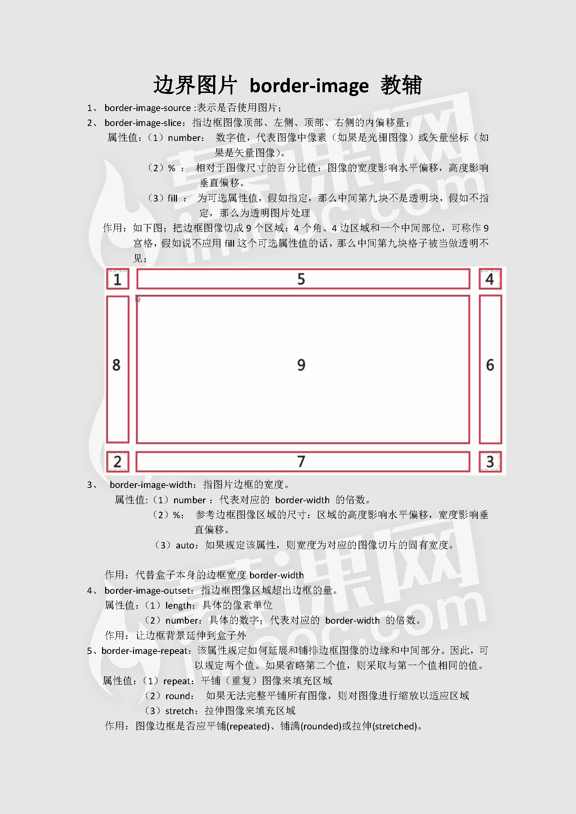

# 边界图片

## 复合写法

```css
div {
  border-image: source slice width outset repeat|stretch|round|initial|inherit;
}
```

- source：必须，指定要用于绘制边框的图像
- slice：可选，图像边界向内偏移，默认值是 100%
- width：可选，图像边界的宽度
- outset：可选，指定在边框外部绘制 border-image-area 的量
- repeat：可选，设置图像边界是否应重复（repeat）、拉伸（stretch）或铺满（round）等等，默认是 stretch

## 单独写法（具体含义同上）

- border-image-source：url(图像地址)；
- border-image-slice：number|%|fill；
- border-image-width：number|%|auto；
- border-image-outset：number；
- border-image-repeat：repeat|stretch|round|initial|inherit；

## 详细解析


