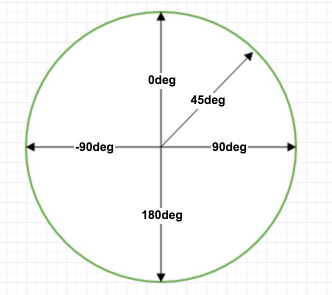
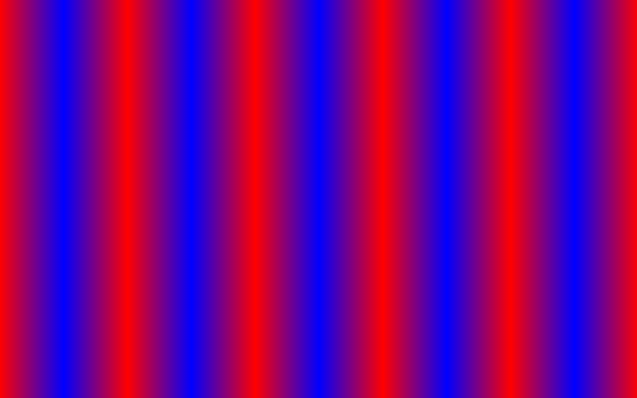
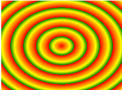

# 渐变（相当于背景图片）

> 定义：两个或多个指定的颜色之间显示平稳的过渡

## 1、线性渐变

> 参考：https://xiaohuochai.site/CSS/render/animation/linearRradient.html

### 1.1、向下（默认值）/向上/向左/向右/对角

`background: linear-gradient(direction, color-stop1, color-stop2, ...);`

- direction：方向

### 1.2、角度

`background: linear-gradient(angle, color-stop1, color-stop2, ...);`

- angle：角度，比如 0deg 表示从下到上



### 1.3、透明度

`background: linear-gradient(to right, rgba(255,0,0,0), rgba(255,0,0,1));`

- 用 rgba()即可

### 1.4、颜色百分比

`background: linear-gradient(red 10%, green 85%, blue 90%);`

- 解析：0% ~ 10%是**纯红色**，10% ~ 90%才是**红绿蓝渐变色**，90% ~ 100%是**纯蓝色**

### 1.5、重复线性渐变

`background: repeating-linear-gradient(color1 数值|百分比, color2 数值|百分比, ...);`



### 1.6、兼容性写法

```css
/* 兼容性写法 */
background: -webkit-linear-gradient(...); /* Safari 5.1 - 6.0 */
background: -o-linear-gradient(...); /* Opera 11.1 - 12.0 */
background: -moz-linear-gradient(...); /* Firefox 3.6 - 15 */
background: (repeating-) linear-gradient(...); /* 标准的语法（必须放在最后） */
```

## 2、径向渐变

> 参考：https://xiaohuochai.site/CSS/render/animation/radialRradient.html

### 2.1、中心往四周

`background: radial-gradient(center, shape size, start-color, ..., last-color);`

- center：渐变的中心点位置，left 与 top，如`60% 40%`
- shape ：渐变的形状，椭圆 ellipse（默认值） 或圆形 circle
- size：渐变的大小
  - closest-side：最近边
  - farthest-side：最远边
  - closest-corner：最近角
  - farthest-corner：最远角（**默认值**）

### 2.2、重复径向渐变



### 2.3、兼容性写法

```css
/* 兼容性写法 */
background: -webkit-radial-gradient(...); /* Safari 5.1 - 6.0 */
background: -o-radial-gradient(...); /* Opera 11.1 - 12.0 */
background: -moz-radial-gradient(...); /* Firefox 3.6 - 15 */
background: (repeating-) radial-gradient(...); /* 标准的语法（必须放在最后） */
```

## 3、IE 浏览器的渐变

```css
filter: progid:DXImageTransform.Microsoft.gradient( startColorstr='#ff0000', endColorstr='#0000ff',GradientType=1);
```

- startcolorstr：开始色
- endcolorstr：结束色
- gradientType：0 表示纵向，1 表示横向

> 详细解析：https://www.cnblogs.com/kyshu/p/9066435.html
