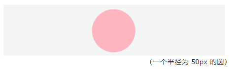

# CSS 常见问题

## 居中问题

> 这里的居中，指的是子元素相对于父元素的居中

- 使用 text-align：center —— 该方法可以让子元素水平居中，但只对图片、按钮、文字等行内元素起作用

  ```
  <div class="container">
      <div class="item"></div>
  </div>

  .container {
      text-align: center;
  }
  ```

- 设置 margin：auto —— 该方法能让子元素水平居中，但是对浮动元素和绝对定位的元素无效<br>
  注意：使用这个方法子元素的宽度需要确定，如果不设置子元素的宽度，默认是父元素的 100%，将不会起作用了

  ```
  .item {
      margin: auto;
  }
  ```

- 绝对定位的居中

  ```
  <div class="container">
      <div class="item"></div>
  </div>

  .container {
      position: relative;
  }
  .item {
      position: absolute;
      transform: translate(-50%, -50%);
      left: 50%;
      top: 50%;
  }
  ```

- 使用 Flex 布局

  ```
  .container {
      display: flex;
      justify-content: center;
      align-items: center;
  }
  ```

## 制作圆形

> 我们通常会设置 border-radius 的值为宽高的一半，或者直接设置 50%的百分比来制作圆形

```
<div class="circle"></div>

.circle {
    width: 100px;
    height: 100px;
    background-color: #FFB5BF;
    border-radius: 50%;      /* 或者 50px */
}
```



## 三角形气泡

> 暂定......

## 阴影

> 参考：https://www.html.cn/tool/css3Preview/Box-Shadow.html
>
> box-shadow 可以添加一个或多个阴影，添加多个阴影需要用逗号隔开。每个阴影由下面几个属性构成

```
.box {
    box-shadow: h-shadow v-shadow blur spread color inset;
}
```

- h-shadow：必需，表示水平阴影的位置，正值阴影向右，负值向左
- v-shadow：必需，表示垂直阴影的位置，正值阴影向下，负值向上
- blur：可选，代表模糊半径
- spread：可选，阴影的尺寸
- color：可选，阴影的颜色
- inset：可选，使用该值可以将外部阴影（outset）转换成内部阴影

  

## animation 动画

> 页面的动画并不完全需要借助 JS，CSS 就能完成，要使用 CSS animation 动画，首先要定义 @keyframes 规则，它用来创建动画，然后使用 animation 属性将动画规则绑定至某个元素上，动画便产生了

暂定......
