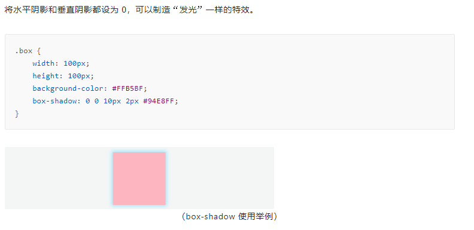

# 阴影

> 动画演示：https://www.html.cn/tool/css3Preview/Box-Shadow.html
>
> box-shadow 可以添加一个或多个阴影，添加多个阴影需要用逗号隔开。每个阴影由下面几个属性构成

```
.box {
    box-shadow: h-shadow v-shadow blur spread color inset;
}
```

- h-shadow：必需，表示水平阴影的位置，正值阴影向右，负值向左
- v-shadow：必需，表示垂直阴影的位置，正值阴影向下，负值向上
- blur：可选，代表模糊半径
- spread：可选，阴影的尺寸
- color：可选，阴影的颜色
- inset：可选，使用该值可以将外部阴影（outset）转换成内部阴影

  
