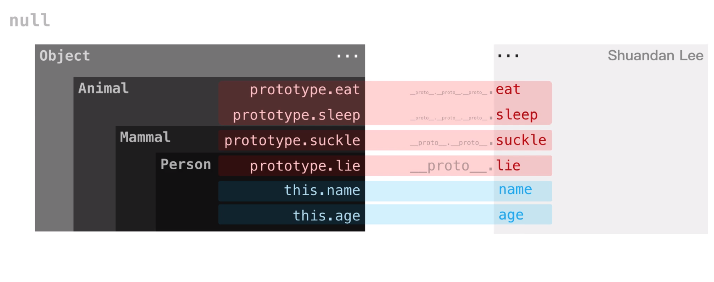

# 原型

## 原型规则五大点（非常重要）

- **所有的引用类型（数组、对象、函数），都具有对象特性，即可自由扩展属性（除了`null`以外）**
- **所有的引用类型（数组、对象、函数），都有一个(隐式原型)`__proto__`属性，属性值是一个普通的对象**
- **所有的函数，都有一个(显式原型)`prototype`属性，属性值也是一个普通的对象**
- **所有的引用类型（数组、对象、函数），`__proto__`属性值指向它的构造函数的`prototype`属性值**
- **（很重要）当试图得到一个对象的某个属性时，如果这个对象本身没有这个属性，那么会去它的`__proto__`(即它的构造函数的 prorotype)中寻找**

## 工厂模式

```javascript
function user(name, age, gender) {
  var person = {};
  person.name = name;
  person.age = age;
  person.gender = gender;
  return person;
}
var whh = user("王花花", 20, "male");
var lsd = user("李栓蛋", 18, "female");
console.log(whh);
console.log(lsd);
```

## 构造器(constructor) —— 动态 new 新对象

```javascript
function User(name, age, gender) {
  this.name = name;
  this.age = age;
  this.gender = gender;
}
var whh = new User("王花花", 20, "male"); // 生成对象也称实例化
var lsd = new User("李栓蛋", 18, "female");
console.log(whh);
console.log(lsd);
```

## prototype(原型)和**proto**

```javascript
function User(name, age) {
  this.name = name;
  this.age = age;
}
// 对比把greet方法写到函数里面，这种方法更节省内存，因为不像函数那样每生成一个对象都复制一遍方法、占用一块内存
User.prototype.greet = function() {
  console.log("我叫: " + this.name + "，我今年岁数是：" + this.age);
};
var whh = new User("王花花", 20);
var lsd = new User("李栓蛋", 18);
whh.greet();
lsd.greet();
// whh.__proto__ === lsd.__proto__
// 结果是true，表明他俩都指向同一个方法，而不是复制两份分别存在whh和lsd对象内，节省了内存
```

## 原生对象的原型

```javascript
var a = {}; // a 的constructor(构造器)是名为 Object() 的方法，等同于var a = new Object();
var aa = []; // aa 的constructor(构造器)是名为 Array() 的方法，等同于var aa = new Array();而且这个Array[爸爸]也是从Object[爷爷]继承的。
console.log(a);
console.log(aa);
// 构建一个没有任何继承关系的对象，方法如下：
var b = Object.create(null);
console.log(b);
// 还可以自己构建它的原型，方法如下：
var c = Object.create({
  haha: 1,
  hehe: 2
});
console.log(c);
//结果如下
//  __proto__:
//    haha: 1
//    hehe: 2
```

## 原型链

> 比如：动物 》哺乳动物 》人类 》某个人

```javascript
function Animal(color, weight) {
  this.color = color;
  this.weight = weight;
}
Animal.prototype.eat = function() {
  console.log("chi chi chi");
};

function Mammal(color, weight) {
  Animal.call(this, color, weight); // 继承个性
}
Mammal.prototype = Object.create(Animal.prototype); // 继承共性
Mammal.prototype.constructor = Mammal; // 重设一下构造器，否则Mammal就没有构造器了
Mammal.prototype.suckle = function() {
  console.log("挤奶");
};

function Person(color, weight) {
  Mammal.call(this, color, weight); // 继承个性
}
Person.prototype = Object.create(Mammal.prototype); // 继承共性
Person.prototype.constructor = Person; // 重设一下构造器，否则Person就没有构造器了
Person.prototype.lie = function() {
  console.log("我很帅");
};

var lsd = new Person("黑色", 65); // 李栓蛋
console.log(lsd);
lsd.eat(); // Animal的能力
lsd.suckle(); // Mammal的能力
lsd.lie(); // Person的能力
var whh = new Person("金色", 100); // 王花花
console.log(whh);
whh.eat();
whh.suckle();
whh.lie();
```


