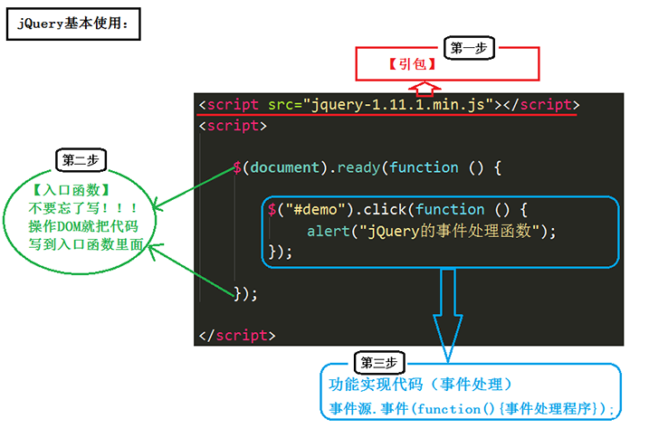

# jq 简介

## 1、原生 js 的痛点？

- window.onload 事件有事件覆盖的问题，因此只能写一次
- 书写很繁琐，代码量多
- 浏览器兼容性问题

## 2、jq 简介

> 其实就是学习 jQuery 封装好的那些 API
> `$`和 `jQuery` 相同

1. 作用

   - HTML 元素获取与操作
   - CSS 操作
   - 事件
   - js 特效与动画
   - DOM 遍历与修改
   - AJAX
   - Utilities

2. 目的

   - 写得更少，做得更多

3. 优势

   - jQuery 兼容于所有主流浏览器
   - 完善的 AJAX
   - 不污染顶级变量
   - 支持链式操作
   - 隐式迭代（无需我们再进行循环）
   - 丰富的插件

## 3、基础



1. `$(selector).action()`

   - `$`等同于 `jQuery`
   - 选择器 selector 是"查询"和"查找" HTML 元素
   - 方法 action() 是执行对元素的操作
   - > 例子：`$("#test").hide()` 隐藏所有 id="test" 的元素

2. 文档在完全加载完之后运行 jQuery 代码

   ```js
   $(document).ready(function() {
     // 开始写 jQuery 代码...
   });
   ```

3. 链式操作

   > "p1" 元素首先会变为红色，然后向上滑动，再然后向下滑动：

   ```js
   $("#p1")
     .css("color", "red")
     .slideUp(2000)
     .slideDown(2000);
   ```

4. noConflict()方法

   > noConflict() 方法会释放对 `$` 标识符的控制，这样其他脚本就可以使用它

   ```js
   // 最优方法：外部释放$，内部仍然使用$
   $.noConflict();
   jQuery(document).ready(function($) {
     $("button").click(function() {
       $("p").text("jQuery 仍然在工作!");
     });
   });
   ```
