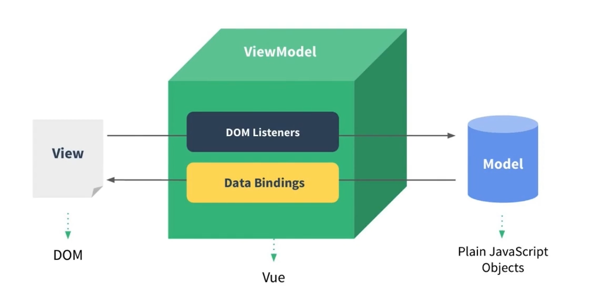

# MVVM 模式

## MVP 模式

1. View 视图
2. Presenter 控制器
3. Model 模型层

**缺点**：M 层很弱，P 层代码大多在操作 DOM

## MVVM 模式

1. View ->DOM
2. ViewModel ->Vue（DOM Listeners、Data Bindings）
3. Model ->Plain JS Objects

**优点**：数据驱动，更注重 M 层

