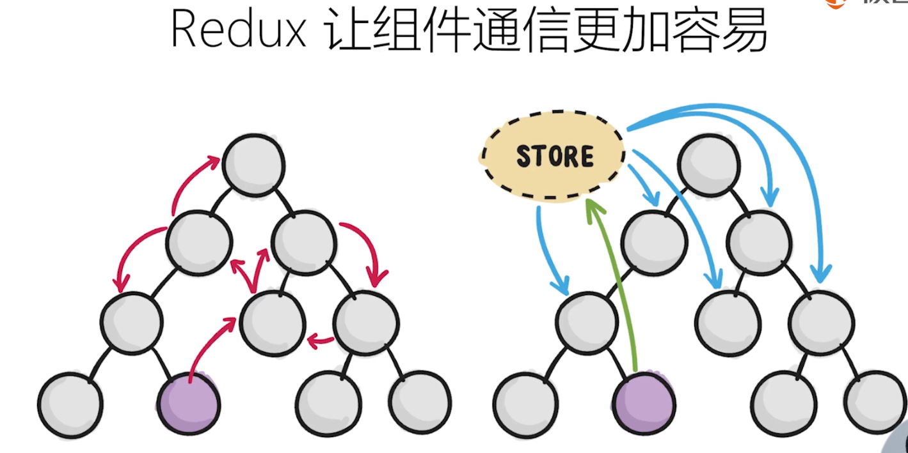
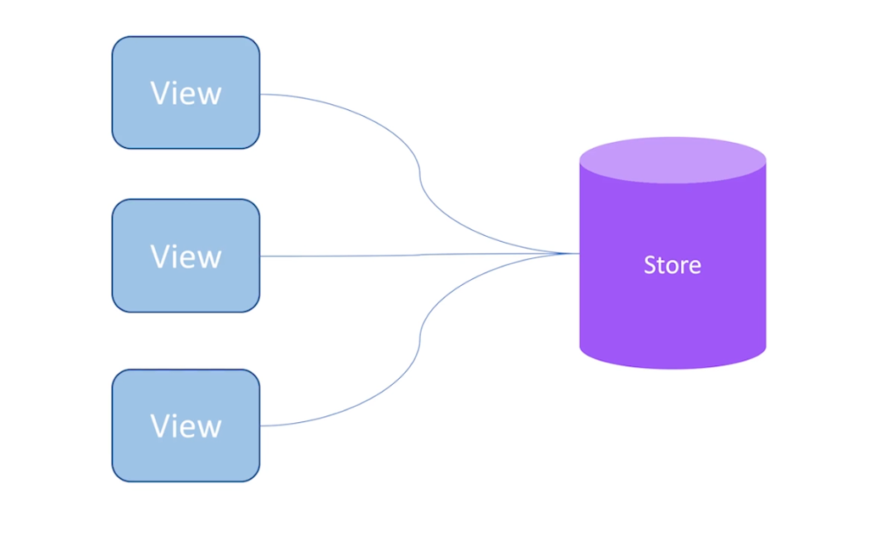
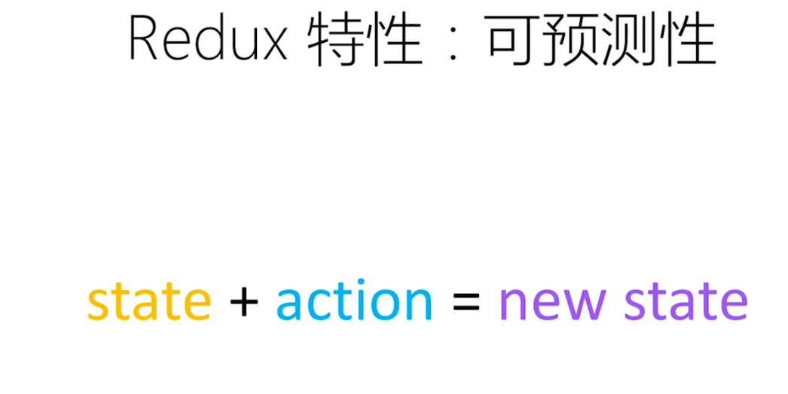
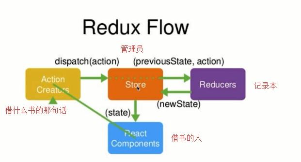
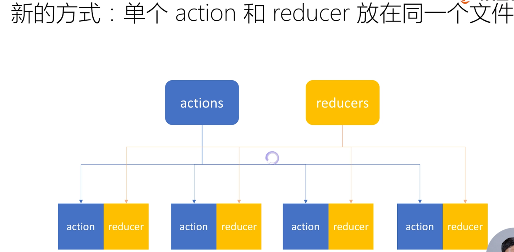

# Redux

> 定义：一个状态管理框架
> 核心思想：把组件的状态放到一个 store 中统一存储、管理，并遵循单向数据流和不可变数据
> 作用：让组件通信更容易
> 强调一下：Redux 和 React 之间没有关系。Redux 支持 React、Angular、Ember、jQuery 甚至纯 JavaScript

### Redux 的可预测性:

### Redux 工作流程:

- actionTypes：新建一个 actionTypes.js 来统一管理 action 的 type

- actionCreators：新建一个 actionCreators.js 来统一生成 action

### 三大基本原则

1. store 只能有一个，当需要拆分数据处理逻辑时，你应该使用多个 reducer 组合而不是创建多个 store
2. 只有 store 能改变自己的内容，而不是 reducer
3. reducer 必须是纯函数
   > 纯函数是指给定固定的输入，就一定会有固定的输出，且不会有任何副作用
   > 如果函数内有异步、ajax 请求、时间等，就不是纯函数了
   > 副作用：对接收的参数进行了修改，所以最好是深拷贝一份副本

### 核心 API 小结

- createStore()：创建一个 store
- store.getState()：获取 store 的所有内容
- store.dispatch(action)：把 action 纯递给 store
- store.subscribe(func)：监听 store 的变化，一旦有变化，就会执行 func 回调函数

### Redux 中发送异步请求

同样的操作，使用 axios，将引出接下来的 Readux 中间件

### 更优方案

> 直接使用 react-redux 库，可理解为 redux 专门为 react 服务的一个库。
> 两个比较关键的概念：Provider 和 connect 方法

### 注意：

- react 中的数据 state 和 redux 的数据 state，没有半毛钱关系。【React 中的 state 是组件内部自己的状态信息，而 Redux 中的 state 是 Redux 自己的数据】

### 如何组织 action 和 reducer

### 不可变数据

1. 使用浅/深拷贝
2. 使用第三方库，如 immutable.js、redux-immutable
