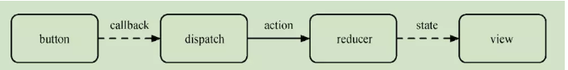
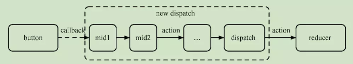

# Redux 中间件

> 定义：在 middleware 中，我们可以检阅每一个流过的 action，并挑选出特定类型的 action 进行相应操作，以此来改变 action。简单来讲，Redux middleware 提供了一个分类处理 action 的机会
>
> 流程：截获 action → 异步处理 → 发出处理完的 action 给 store → store 发给 reducer，reducer 根据不同 action 做出不同的处理
>
> 注意：异步 action 不是特殊 action，而是多个同步 action 的组合使用（比如：ajax 成功就返回 action A，失败就返回 action B，等等...），最后 reducer 就根据不同的 action 做出不同的处理

- 何时截获？
  答：如果这个 action 是一个函数，而非对象，就会截获，并且执行这个函数（这个函数往往就是处理异步操作的）

- 对比

  - 不使用中间件：dispatch()方法接收一个对象（即 action），然后直接就发送给 store，store 再发给 reducer

    

  - 使用中间件：此时给 dispatch()方法接收的是一个函数，它就会执行这个函数，而函数内部就是一些异步的操作，然后返回新的 action（比如成功后的 action A，或者失败后的 action B），最后 reducer 就根据不同的 action 做出不同的处理

    

### 一、Redux-thunk

- 使用场景
  简单的项目

- 异步代码放到哪？
  放到 actionCreators.js 中执行

### 二、更优选择之 Redux-saga

- 使用场景
  复杂的项目

- 异步代码放到哪？
  单独一个 sagas.js 文件，集中管理异步操作，与同步操作分离
