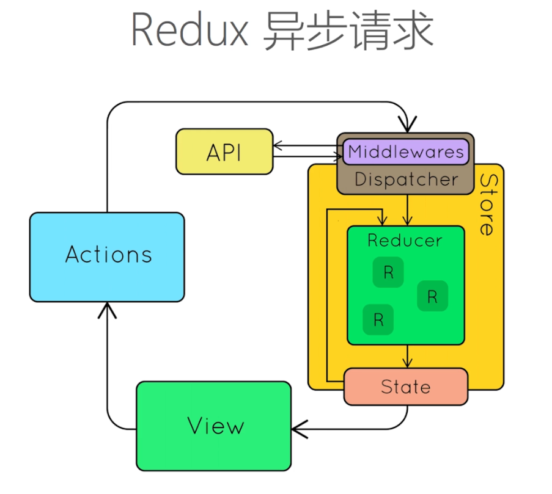

# Redux 中间件

> 作用：异步代码拆分，处理异步操作

### 什么是 Redux 的中间件？

> 中间件指的就是对 dispatch()方法的封装、升级

- 中间：action 和 store 之间
- 对比
  - 最原始的 dispatch()方法接收一个对象（即 action），然后发送给 store
  - 使用中间件：此时给 dispatch()方法接收的是一个函数，它就会执行这个函数，而函数内部就是一些异步的操作

### Redux-thunk

- 为什么要用？

  1. 因为如果你把异步函数（比如 ajax 请求）放到组件的生命周期函数中执行，这个生命周期钩子会变得越来越复杂
  2. 方便自动化测试

- 使得 action 可以是函数，而不限制只能是对象

- ajax 请求放到哪里执行？
  放到 actionCreators.js 中执行

### 更优选择之 Redux-saga

- 异步代码放到哪？
  新建 sagas.js，放到这里边
