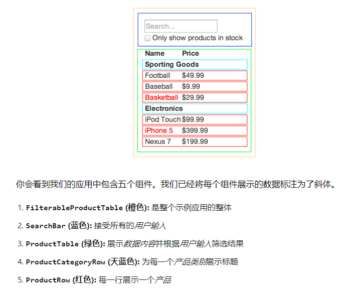
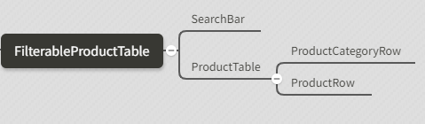

# React 开发流程

### 【1】将设计好的 UI 划分为组件层级

1. 你需要在设计稿上用方框圈出每一个组件，并且以合适的名称命名

   - **单一功能原则**：一个组件只负责一个功能

   

2. 画出组件树

   

### 【2】创建一个静态版本

1. 数据全部写死，能展示即可
2. 用已有的数据模型渲染一个不包含交互功能的 UI

   - 通过 props 传入所需的数据
   - 完全不应该使用 state 构建静态版本。state 代表了随时间会产生变化的数据，应当仅在实现交互时使用

3. 建议使用自下而上的顺序：也即从最基本的组件开始编写

   - 在 React 中，有两类数据“模型”：state 和 props
   - React 单向数据流（也叫单向绑定）的思想使得组件模块化，易于快速开发

### 【3】确定 state 放置的位置

1. 确定哪个组件能够改变这些 state，或者说拥有这些 state
   - 具体思路：
     1. 找到根据这个 state 进行渲染的所有组件
     2. 找到他们的共同所有者组件（即在组件层级上高于所有需要该 state 的那一个组件）
     3. 该共同所有者组件或者比它层级更高的组件应该拥有该 state
   - 特殊情况：如果你真的找不到一个合适的位置来存放该 state，就可以直接创建一个新的组件来存放该 state，并将这一新组件置于高于共同所有者组件层级的位置
2. **原则：尽量让大多数的组件都是无状态的**
   - 解析：
     1. 拥有 state 的组件（容器组件）用于处理各种事件、交流逻辑、修改 state 等
     2. 无状态组件唯一关心的事情就是根据传入的属性来渲染页面

### 【4】确定 state 的最小完整表示（即 state 应该包含什么）

1. **DRY 原则**：只保留应用所需的可变 state 的最小集合，其他数据均由它们计算产生
   - 具体思路：
     1. 该数据是否是由父组件通过 props 传递而来的？如果是，那它应该不是 state
     2. 该数据是否随时间的推移而保持不变？如果是，那它应该也不是 state
     3. 你能否根据其他 state 或 props 计算出该数据的值？如果是，那它也不是 state

本案例中：

- 我们已经决定把这些 state 存放在 FilterableProductTable 组件中
- 首先，将实例属性 this.state = {filterText: '', inStockOnly: false} 添加到 FilterableProductTable 的 constructor 中，设置应用的初始 state
- 接着，将 filterText 和 inStockOnly 作为 props 传入 ProductTable 和 SearchBar
- 最后，用这些 props 筛选 ProductTable 中的产品信息，并设置 SearchBar 的表单值

### 【5】添加反向数据流

1. 处于较低层级的表单组件更新较高层级的 FilterableProductTable 中的 state
   - 具体思路：
     1. FilterableProductTable 必须将一个能够触发 state 改变的回调函数（callback）传递给 SearchBar
     2. SearchBar 通过 props 接收并调用这个回调函数
     3. 最终实现 state 的更新
