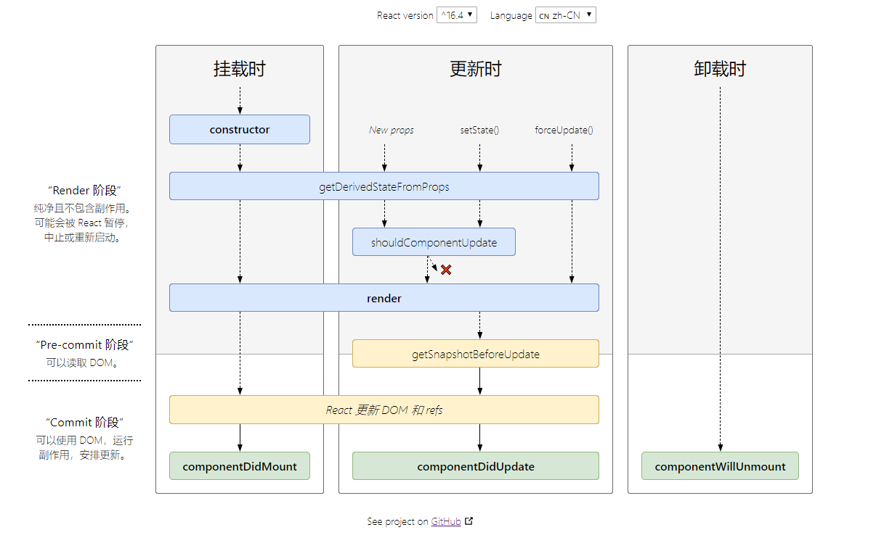
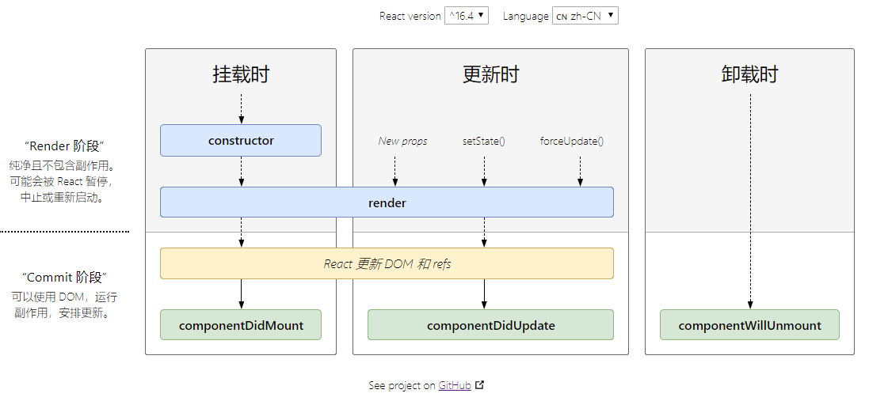

## 生命周期

> 如果有父子关系，执行顺序的进出口都是 render【即父的生命周期执行到 render，就会进入到子的生命周期，子执行完后就会出来，然后父从 render 继续往下执行】

- `constructor(props)`

  - 构造函数仅用于以下两种情况：
    1. 通过给 this.state 赋值对象来初始化内部 state
    2. 为事件处理函数绑定实例

- `static getDerivedStateFromProps(props, state)`

  1. 当 state 需要从 props 初始化时使用
  2. 尽量不要使用：因为维护二者状态一致性会增加复杂度
  3. 每次 render 都会调用
  4. 典型场景：表单控件获取默认值

- `shouldComponentUpdate(nextProps, nextState)`

  1. 决定是否 render
  2. 一般可以用 PueComponent 自动实现
  3. 典型场景：性能优化

- `render()`

  1. 是 class 组件中唯一必须实现的方法
  2. render() 函数应该为纯函数
  3. 注意：此时的 DOM 和 refs 还没更新

- `getSnapshotBeforeUpdate(prevProps, prevState)`

  1. 在 render 之后调用，state 已更新
  2. 典型场景：获取 render 之后的 DOM 状态

- `componentDidMount()`

  1. UI 挂载完成后调用
  2. 只执行一次
  3. 典型场景：获取外部资源

- `componentDidUpdate(prevProps, prevState, snapshot)`

  1. 每次 UI 更新时被调用
  2. 典型场景：页面需要根据 props 变化重新获取数据

- `componentWillUnmount()`

  1. 组件移除时调用
  2. 典型场景：资源释放

### 常用的生命周期

