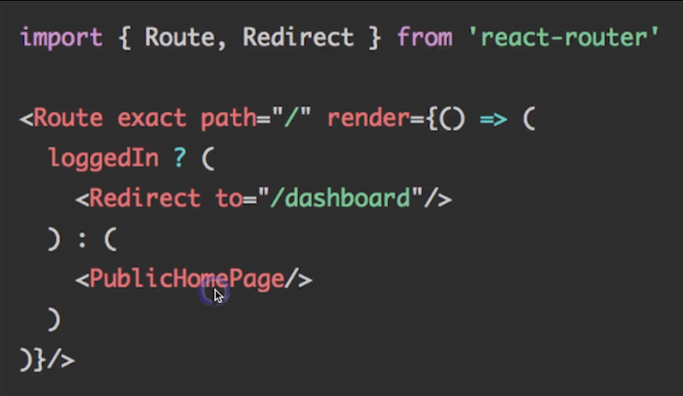
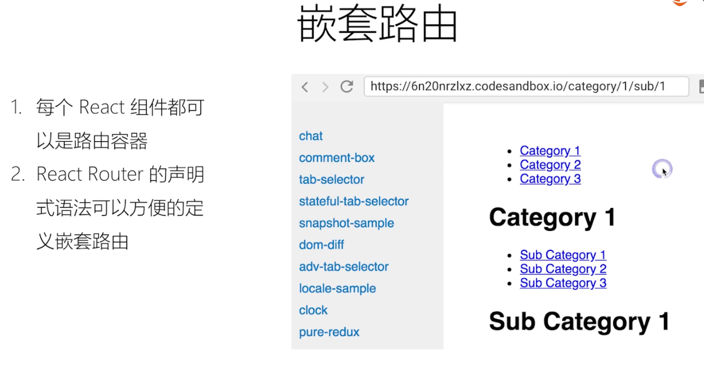

# 路由 react-router

### 为什么需要路由？

1. 单页面应用需要进行页面切换
2. 通过 URL 可定位到页面
3. 更有语义的组织资源


### 路由的特性

1. 声明式路由定义
2. 动态路由

### 三种路由的实现方式

1. URL 路径【推荐】
2. hash 路由：通过#
3. 内存路由：服务器端渲染常用，URL 并不会发生变化

### 基于路由进行资源组织

1. 实现业务逻辑的松耦合
2. 易于扩展、重构和维护
3. 路由层面实现 Lazy Load：懒加载

### 核心 API

1. BrowserRouter：创建一个路由，只能有一个根节点
2. Route：路径匹配时，显示对应组件

   ```html
   <BrowserRouter>
     <div>
       <Route exact path="/" component="{NewList}" />
       <Route path="/button:id" component="{NewButton}" />
     </div>
   </BrowserRouter>
   ```

3. Switch：只显示第一个匹配成功的路由
4. Link：普通链接。可以携带参数，参数可通过`this.props.match.params.xxx`获取

   ```html
   <Link to="/list/mes">
     <Button type="primary">按钮</Button>
   </Link>
   ```

5. NavLink：类似 Link，但会添加当前选中状态

   ```html
   <NavLink to="/list" activeClassName="selected">
     <button type="primary">按钮</button>
   </NavLink>
   ```

6. Redirect：重定向当前页面，例如登陆判断

   

7. withRouter：可以包装任何自定义组件，将 react-router 的 history,location,match 三个对象传入，实现任意跳转
8. Prompt：满足条件时提示用户是否离开当前页面

   ```html
   <Prompt when="{formIsOut}" message="你确定离开此页面吗？" />>
   ```

### 页面状态尽量通过 URL 参数定义

### 嵌套路由：

> 实现多级导航


