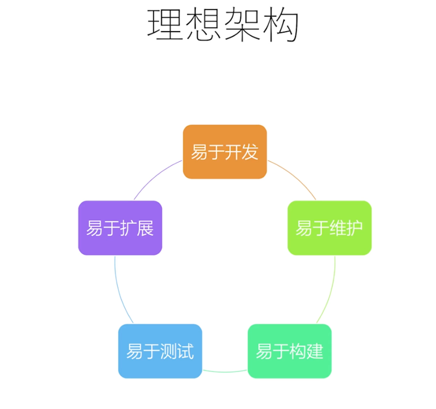

# 前端开发的理想架构

### 易于开发

1. 开发工具是否完善
2. 生态圈是否繁荣
3. 社区是否活跃

### 易于扩展

1. 增加新功能是否容易
2. 是否会增加系统复杂度

### 易于维护

1. 代码是否容易理解
2. 文档是否健全

### 易于构建

1. 使用通用的技术和架构
2. 构建工具的选择

### 易于测试

1. 功能的分层是否清晰
2. 副作用少
3. 尽量使用纯函数

