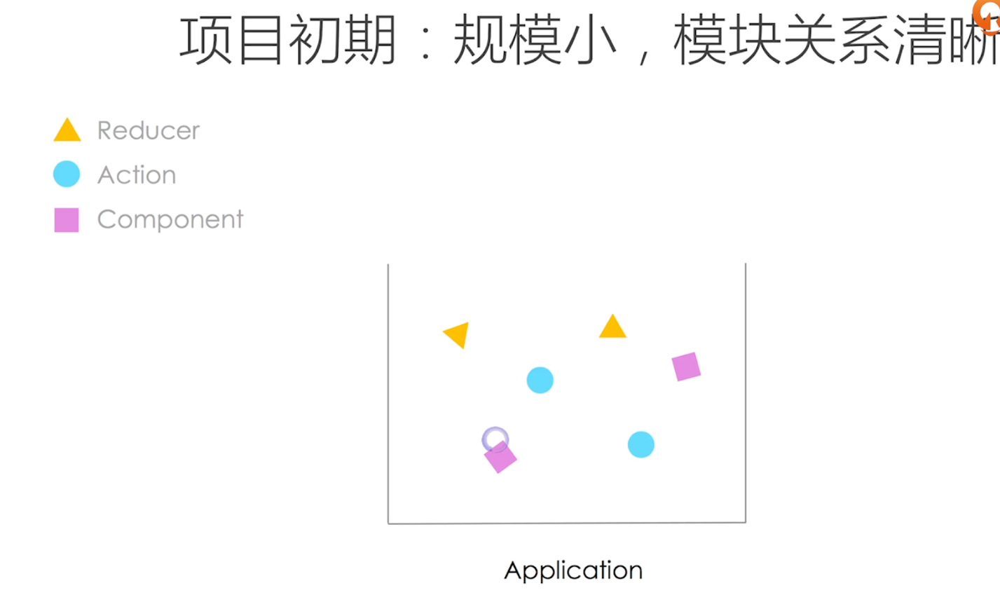
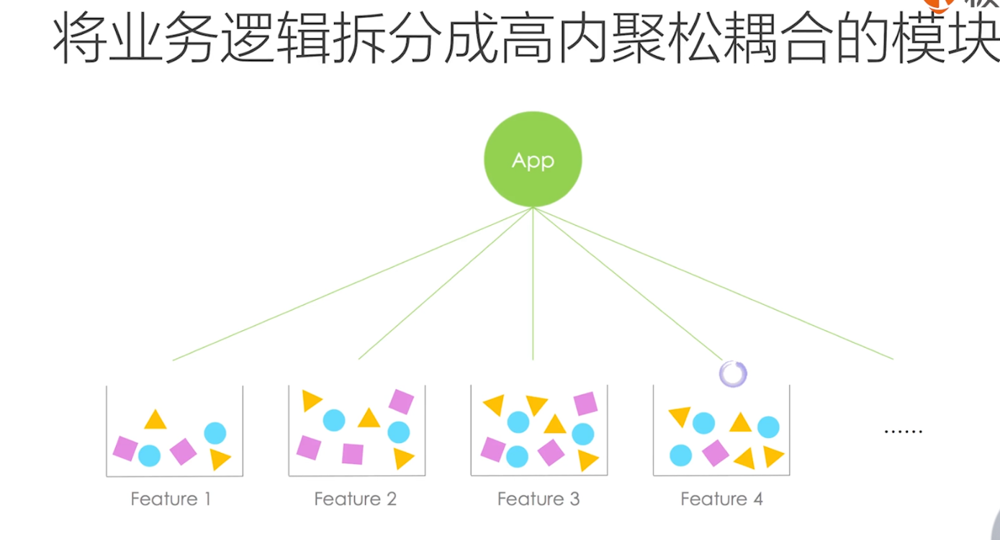
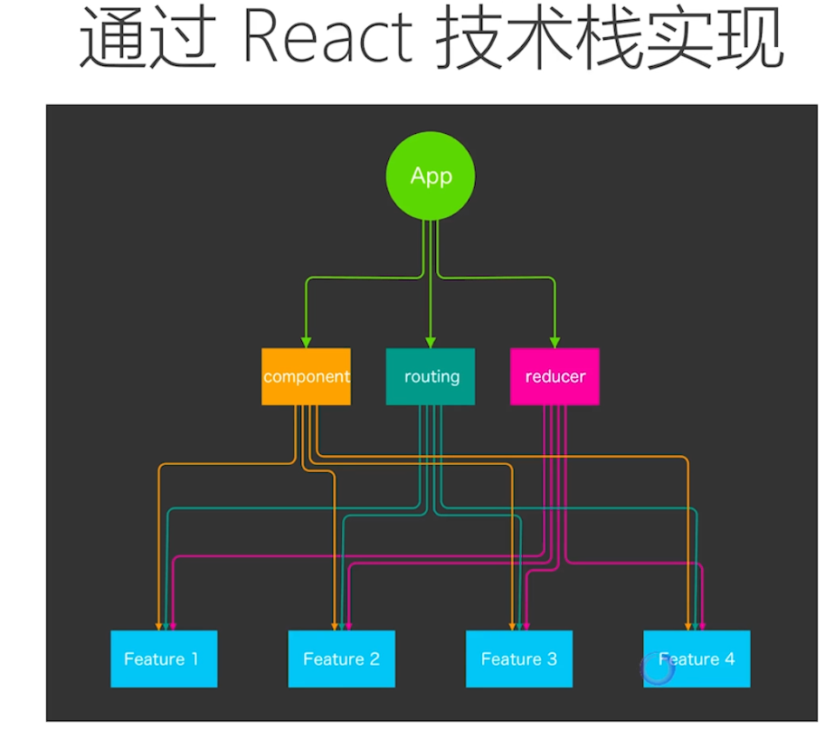
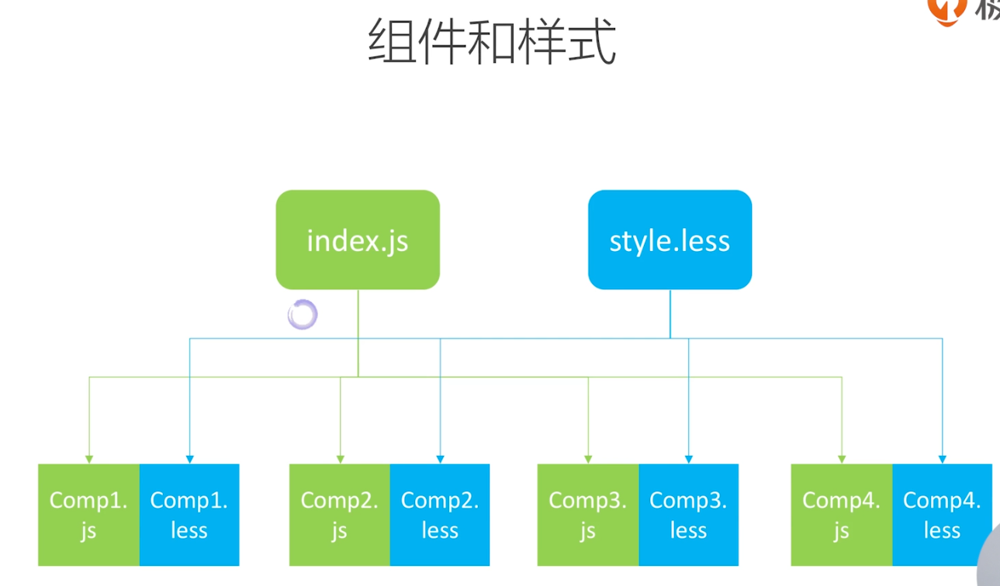
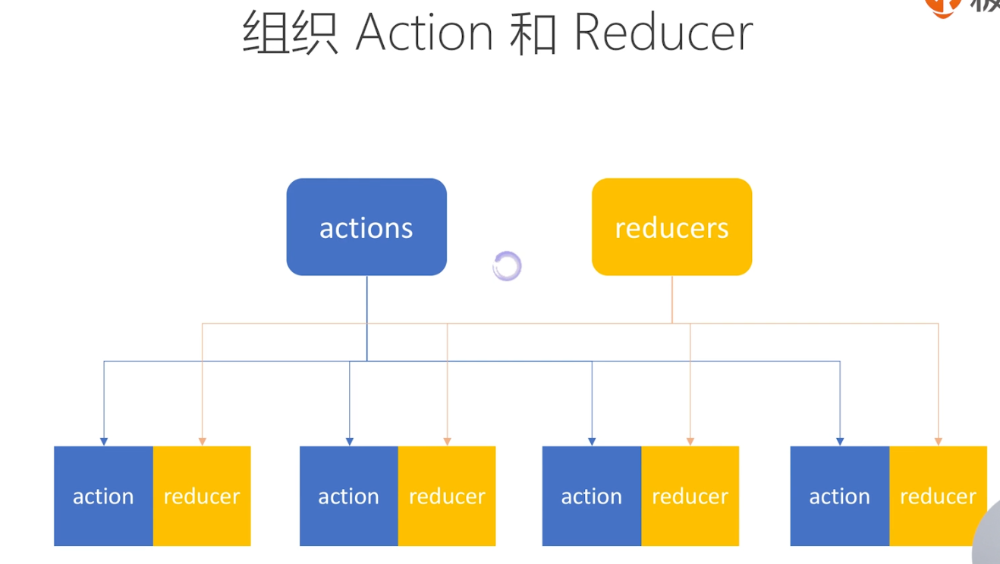
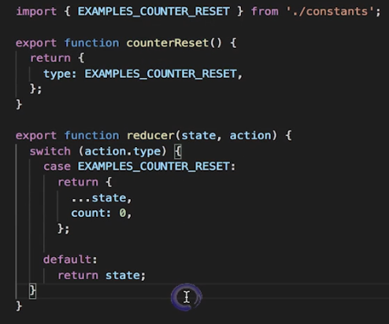
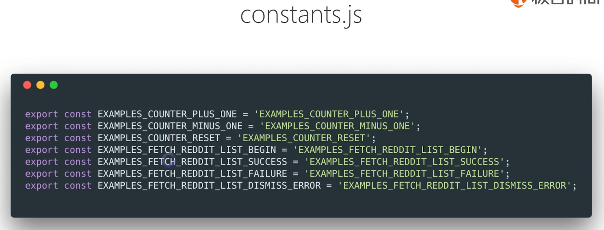
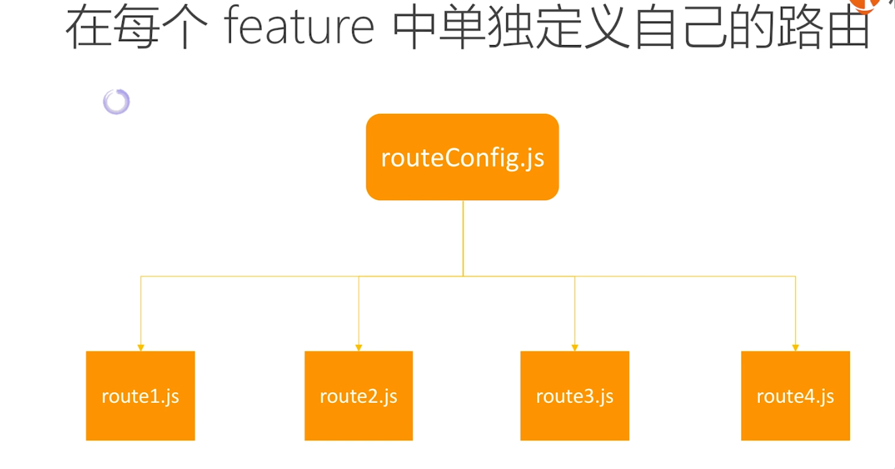
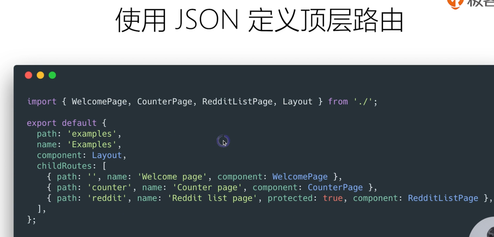
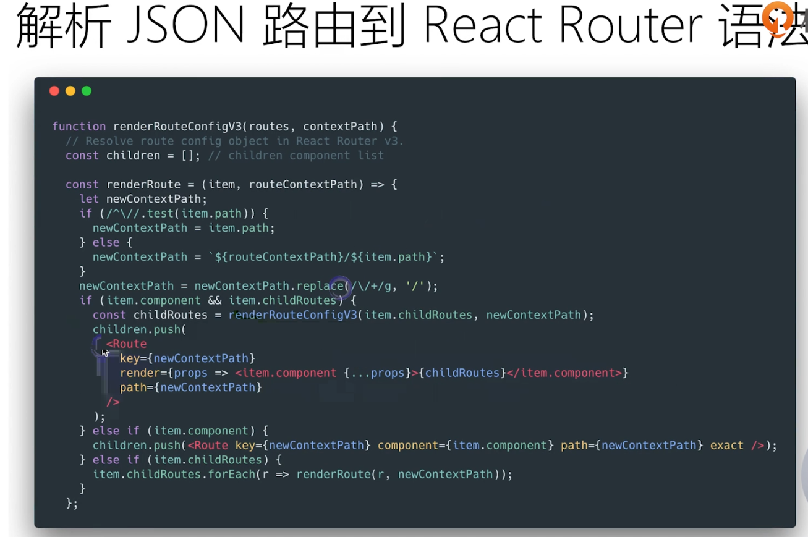

# 拆分复杂度

## 一、按领域模型（feature）组织代码，降低耦合度

> 高内聚：相关代码放在一个文件中
> 松耦合；不同文件之间影响较小

- 杂乱的情况
  

  

  

- 从功能层面区分：

  

  

- React 的最佳实践

  > index.js 和 style.css 作为出入口：

  

  > action.js 和 reducer.js 作为出入口：

  

  

  > constants.js 常量：

  

## 二、组织路由

## 三、使用 Rekit
