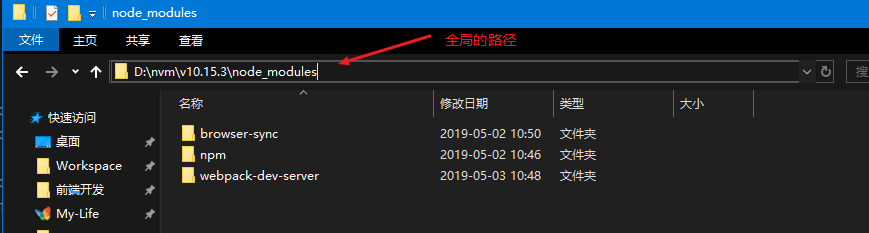

# 全局安装和局部安装的区别

1. `npm install xxx -g`，模块将被下载安装到【全局目录】中,【全局目录】通过 `npm config set prefix 目录路径` 来设置

   - 例如：当我们使用了 `npm install -g express` 安装了 express 框架后，我们就可以在电脑里的某一个文件夹下，打开控制台，直接使用 express mvc 创建项目；否则会遇到`"'express' 不是内部或外部命令，也不是可运行的程序"`错误。

   

2. `npm install xxx`，则是将模块下载到当前命令行所在目录
   - 例如：`c:\demo> npm install xxx`，将会安装到 `c:\demo\node_modules\xxx`

---

总结：局部安装的版本问题更好控制
