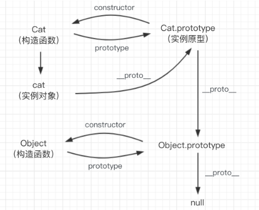
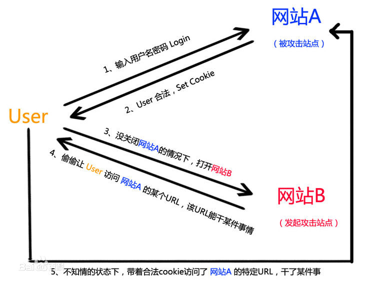

# 面试模拟

### 一面【基础】

- 页面布局
- CSS 盒模型
- DOM 事件
- HTTP 协议
- 类型转换
- 面向对象
- 原型链
- 通信
- 安全
- 算法

1. 页面布局

   题目：左右固定、中间自适应（高度已知/未知）

   - 方案：
     - float
     - 绝对定位
     - flex
     - table
     - grid

   总结：无论是什么布局方式，无外乎需要应用 float、inline-block、table、absolute、flex、grid 这 6 种布局属性，然后再配合负 margin、calc()函数、BFC、增加结构等来实现布局

2. CSS 盒模型

   题目：谈谈对 CSS 盒模型的认识

   - 基本概念：标准盒模型 + IE 盒模型
     - 答：直接画出来
   - 区别：标准盒模型 + IE 盒模型
     - 答：宽高的定义不同，直接画出来
   - CSS 如何设置
     - 答：`box-sizing: content-box`与`box-sizing: border-box`
   - JS 如何获取盒模型的宽高
     - 答：`dom.style.width/height`；`window.getComputedStyle(dom).width/height`；`dom.getBoundingClientRect().width/height`
   - 外边距重叠问题
     - 答：margin，取较大者；父子间、兄弟间；只发生在垂直方向上
   - BFC（外边距重叠解决方案）
     - 概念：块级格式化上下文
     - 原理：渲染规则
     - 创建：`overflow: hidden/auto;`
     - 使用场景：避免外边距重叠、清除浮动

3. DOM 事件

   - DOM 事件的级别：0 级，2 级，3 级
   - DOM 事件模型：冒泡（内到外）与捕获（外到内）
   - DOM 事件流：事件的传递流（捕获 → 目标阶段 → 冒泡）
   - 描述 DOM 事件的具体流程
     - 捕获：window→document→html→body→...→ 目标
     - 冒泡：反之
   - event 对象的常见应用
     - 阻止默认行为：`event.preventDefault()`，比如 a 标签
     - 阻止捕获/冒泡：`event.stopPropagation()`
     - 阻止剩余的事件处理函数的执行，并防止当前事件在 DOM 树上冒泡：`event.stopImmediatePropagation()`
     - 返回绑定事件的元素（事件委托）：`event.currentTarget()`
     - 返回触发事件的元素（事件委托）：`event.target()`
   - 自定义事件

4. 类型转换

   - 数据类型：......
   - 显示转换
     - Number 函数
     - String 函数
     - Boolean 函数
   - 隐式转换
   - 类型判断：https://segmentfault.com/a/1190000002962215
   - 浅拷贝与深拷贝：https://github.com/ljianshu/Blog/issues/5

5. HTTP 协议

   - HTTP 协议的主要特点
     - 简单快速：url 是固定的，所以在 http 协议中很简单
     - 灵活：通过一个 http 协议就可以实现不同资源的传输
     - 无连接：连接一次就会断开
     - 无状态：客户端和服务端不会保存状态
   - HTTP 报文的组成部分
     - 请求报文
       - 请求行：方法、URL、协议版本
       - 请求头：key-value 格式
       - 空行
       - 请求体：数据
     - 响应报文
       - 状态行：协议版本、状态码、状态码描述
       - 响应头：key-value 格式
       - 空行
       - 响应体：数据
   - HTTP 方法
     - GET：获取资源
     - POST：传输资源
     - HEAD：获得报文首部
   - POST 和 GET 的区别
     - **GET 回退时是无害的，而 POST 会再次提交请求**
     - GET 产生的 URL 地址可以被收藏，而 POST 不会
     - **GET 请求会被浏览器主动缓存，而 POST 则不会，除非手动设置**
     - GET 只支持 url 编码，而 POST 支持多种编码
     - **GET 请求参数会被完整保留在浏览器历史记录中，而 POST 不会**
     - **GET 请求在 URL 中传送的参数是有长度限制的，而 POST 没有限制**
     - 对参数的数据类型，GET 只接受 ASCII 字符，而 POST 没有限制
     - **POST 更安全，因为 GET 的参数会直接暴露在 URL 中**
     - **GET 参数通过 URL 传递，POST 放在 Request body 中**
   - HTTP 状态码
     - 1xx：指示信息-表示请求已接收，继续处理
     - 2xx：成功-表示请求已被成功接收【200、206】
     - 3xx：重定向-表示要完成请求必须进行更进一步的操作【301、302、304 使用缓存】
     - 4xx：客户端错误-请求有语法错误或请求失败【400、401、403 资源禁止访问、404 资源不存在】
     - 5xx：服务器错误-服务器未能实现合法的请求【500、503】
   - 什么是持久连接（HTTP/1.1 版本时才支持）
     - 当使用普通模式，即非 Keep-Alive 模式时，每个请求/响应时客户端和服务端都要新建一个连接，完成后就断开（HTTP 为无连接协议）
     - 当使用 Keep-Alive 模式时，使得连接持续有效
   - 什么是管线化
     - 在持久连接前提下，仅 HTTP/1.1 版本支持
     - 请求 1->请求 2->请求 3->响应 1->响应 2->响应 3

6. 原型链

   

   - 创建对象有几种方法
     1. 字面量
     2. 构造函数
     3. `Object.create()`
   - 原型、构造函数、对象实例、原型链
     - 如上图所示
   - instanceof 原理
     - `实例 instanceof 构造函数`
     - 本质：`实例的__proto__`和`构造函数.prototype`是否引用同一个原型，并且会沿着原型链继续走下去
     - 正因为会沿着原型链，所以使用 constructor 判断更严谨
   - new 运算符
     - 第一步：一个新的空对象被创建，它继承自`foo.prototype`
     - 第二步：this 会指定为这个新实例
     - 第三步：如果返回一个新对象，则取代第一步的对象；否则用第一步的对象

7. 面向对象

   - 类与实例
     - 类的声明
     - 生成示例
   - 类与继承
     - 如何实现继承
     - 几种继承方式

8. 通信类

   - 什么是同源策略及限制
     - 源：协议 + 域名 + 端口
     - 同源策略限制从一个源加载的文档或脚本如何与来自另一个源的资源进行交互。这是一个用于隔离潜在恶意文件的安全机制
       - Cookie、LocalStorage 和 IndexDB 无法读取
       - DOM 无法获取
       - Ajax 请求无效
   - 前后端如何通信
     - Ajax
     - WebSocket
     - CORS
   - 如何创建 Ajax（原生 js、jq、vue）
     - XMLHttpRequest 对象的工作流程（5 步）
     - 兼容性处理（针对 IE 的兼容）
     - 事件的触发条件
     - 事件的触发顺序
   - 跨域通信的几种方式
     - JSONP（不推荐）
       - 原理：利用 script 标签的异步加载实现的
     - Hash（页面不刷新）
     - postMessage（H5 新增）
     - WebSocket
     - CORS（相当于 Ajax 第二版，推荐）
       - 利用 fetch 这个 API

9. 安全类

   > 参考：https://github.com/ljianshu/Blog/issues/56

   - CSRF

     - 基本概念：跨站请求伪造，攻击者构造出一个后端请求地址，诱导用户点击或者通过某些途径自动发起请求
     - 攻击原理：

       

     - 防御措施
       - 添加 Token 验证
       - Referer 验证（页面来源验证）
       - 隐藏令牌（类似 Token）

   - XSS
     - 基本概念：跨域脚本攻击，攻击者想尽一切办法将可以执行的代码注入到网页中
     - 防御措施：http://www.imooc.com/learn/812
       - 转义字符
       - CSP：建立白名单

10. 算法类

    - 排序
      - 快速排序
      - 选择排序
      - 希尔排序
    - 栈堆、队列、链表
    - 递归

### 二面【进阶】

- 页面渲染
- JS 运行机制
- 页面性能
- 错误监控
- MVVM 框架

1. 渲染机制

   - DOCTYPE 概念及作用
     - DTD 是一系列的语法规则，用来定义 XML 或 HTML 的文件类型。浏览器会使用它来判断文档类型，决定使用何种协议来解析和切换浏览器模式
     - DOCTYPE 是用来声明文档类型和 DTD 规范的
     - HTML5、HTML4.01 等版本
   - 浏览器渲染过程：https://github.com/ljianshu/Blog/issues/24
   - 重排 Reflow
     - DOM 中的各个元素都有自己的盒子，这些都需要浏览器根据各种样式来计算并根据计算结果将元素放到相应的位置
     - 触发 Reflow：
       - 增删改 DOM 节点
       - 移动 DOM 位置
       - 修改 CSS 样式
       - Resize 窗口（移动端没有这个问题），或滚动
       - 修改网页默认字体
   - 重绘 Repaint
     - 元素各自的特性如位置、大小、属性等绘制在页面中
     - 触发 Repaint：
       - DOM 改动
       - CSS 改动

2. JS 运行机制

   - JS 单线程：任务只能一个接着一个被执行
   - 任务队列（先同步、后异步）

     - 同步任务；比如`console.log()`
     - 异步任务：比如`setTimeout()、DOM事件、Promise`，**并且必须在所有同步任务完成之后才执行**

     ```js
     console.log(1);
     setTimeout(() => {
       console.log(2);
     }, 0);
     console.log(3);
     console.log(4);
     /*
      * 结果：1 3 4 2
      */

     console.log('A');
     while (true) {}
     console.log('B');
     /*
      * 结果：A
      * 解析：while (true) {} 这个同步任务一直在执行，所以轮不到下一个同步任务B的执行
      */

     console.log('A');
     setTimeout(() => {
       console.log('B');
     }, 0);
     while (true) {}
     /*
      * 结果：A
      * 解析：while (true) {} 这个同步任务一直在执行，轮不到异步任务执行
      */

     for (var i = 0; i < 4; i++) {
       setTimeout(() => {
         console.log(i);
       }, 1000);
     }
     /*
      * 结果：1s后同时输出4 4 4 4
      * 解析：先循环4次，但是1s后才把setTimeout放到循环中，所以直接输出4个4（重点是异步任务的放入时间和执行时间是不同的）
      */
     ```

   - Event Loop 事件循环
     - 参考：https://www.yuque.com/fe9/basic/cdpfk3

3. 页面性能

   - 资源压缩合并，减少 HTTP 请求
   - 非核心代码异步加载 → 异步加载的方式 → 这些方式的区别
     - 异步加载的方式
       1. 动态脚本加载：也即动态创建 DOM 节点
       2. defer
       3. async
     - 区别
       1. defer 是在 HTML 解析完之后才会执行，如果有多个 defer，按照加载顺序依次执行
       2. async 是在脚本加载完之后立即执行，如果有多个 async，执行顺序和加载顺序无关
   - **利用浏览器缓存** → 缓存的策略 → 缓存原理
     - 缓存的策略
       1. 强缓存：在以下 2 个时间之前/以内，都不会发送请求，直接使用缓存。以相对时间为基准
          - 过期时间（服务器的绝对时间）：`Expires: Sun, 02 Jun 2019 10:44:37 GMT`
          - 相对时间：`Cache-Control: max-age=30` 这个指 30 秒
       2. 协商缓存：问一下服务器能不能直接用
          - `Last-Modified: Wed, 19 Apr 2017 16:05:19 GMT`
          - `If-Modified-Since`
          - `Etag`
          - `If-None-Match`
   - 利用 CDN
   - 预解析 DNS
     - 打开 a 标签的 DNS 预解析：`<meta http-equiv="x-dns-prefetch-control" content="on" />`
     - `<link rel="dns-prefetch" href="//host_name_to_prefetch.com" />`

4. 错误监控

   - 前端错误的分类
     1. 代码错误
     2. 资源加载错误
   - 各种错误的捕获方式

     - 代码错误

       1. `try...catch`
       2. `window.onerror`

     - 资源加载错误

       1. `object.onerror`
       2. `performance.getEntries()`
       3. Error 事件捕获（注意不是冒泡）

     - 跨域的 js 错误怎么捕获？
       1. 在 script 标签添加 crossorigin 属性
       2. 设置 js 资源响应头`Access-Control-Allow-Origin:*`

   - 上报错误的基本原理
     1. 利用 Image 对象上报：`new Image().src = 'http://baidu.com/testjk?r=tksjk';`
     2. 采用 Ajax 通讯的方式上报

5. MVVM 框架

   > 参考：https://juejin.im/book/5bdc715fe51d454e755f75ef?referrer=574f8d8d2e958a005fd4edac

   - 你对 MVVM 的认识
     - 先聊 MVC
     - 聊聊 MVVM 的定义
     - 对比 MVC 和 MVVM
   - 双向绑定是什么原理
     - view <——> data
     - data→view：`Object.defineProperty`核心
     - view→data：input 事件
     - 参考：https://www.cnblogs.com/wangjiachen666/p/9883916.html
     - ES6 中：`reflect.defineProperty`返回布尔值
   - 使用了设计模式
     - 观察者模式（最好能写出伪代码）
   - 生命周期是什么
     - 参考：https://www.cnblogs.com/nylcy/p/9496462.html
   - 了解源码

### 三面【业务】

- 业务能力
- 团队合作能力

### 总结

- JD 描述
  看清楚工作内容和能力要求

- 简历
  对照 JD 描述来写

- 自我介绍
  一定要打好草稿

- 一面
  重基础、懂原理、要思考

- 二面
  横向、纵向扩展

- 三面
  有经验、懂合作、项目结合、有担当

- HR 面
  会沟通、要上进、好性格、有主见、强逻辑

- 复盘
  胜不骄、败不馁、总结经验、多拿几个 offer
