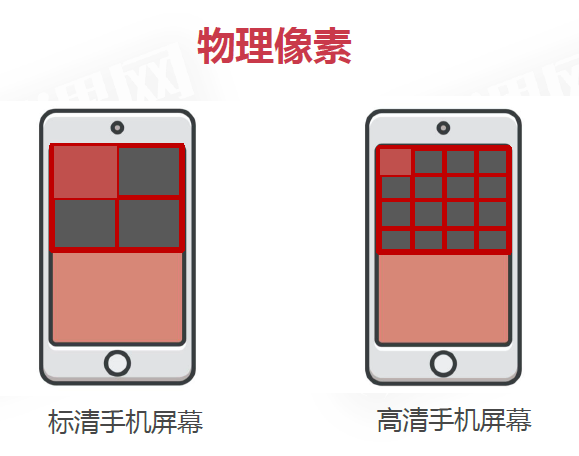
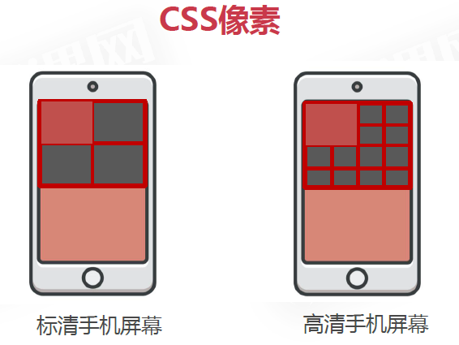
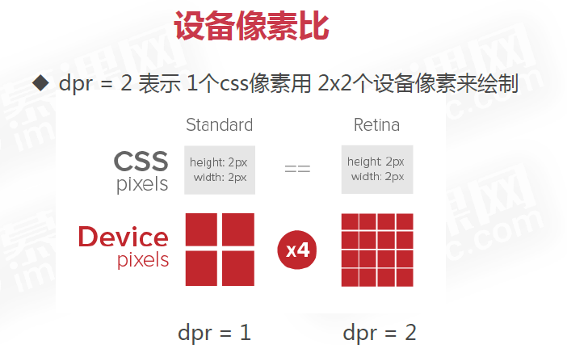
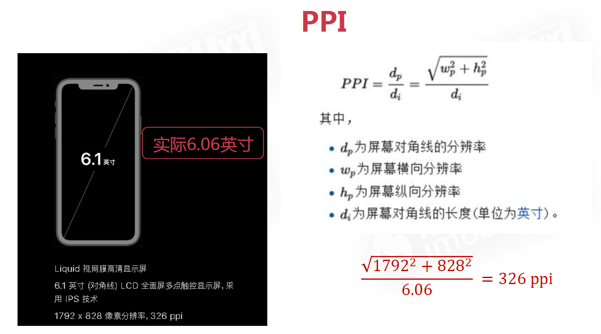

# 基础概念

### 一、像素

- 物理像素/设备像素（固定不变）：分辨率 1920 × 1080 = 像素点数

  

- CSS 像素：实际开发中使用的像素

  

- 设备像素比（dpr）：dpr = 物理像素 ÷ CSS 像素

  

- 缩放：缩放的是 CSS 像素的大小

- ppi/dpi：每英寸的物理像素点，可理解为像素密度

  

### 二、视口 viewport

> 在 CSS 标准文档中，视口 viewport 被称为初始包含块。这个初始包含块是所有 CSS 百分比宽度推算的根源，它给 CSS 布局限制了一个最大宽度
>
> 1. 在桌面浏览器中，浏览器窗口就是约束 CSS 布局的视口
> 2. 在手机端，布局视口会限制 CSS 布局；视觉视口表示浏览器的可视区域，决定用户看到什么；理想视口是对于特定设备的特定浏览器的布局视口的一个理想尺寸

- 最佳实践：

  ```html
  <meta
    name="viewport"
    content="width=device-width, initial-scale=1, maximum-scale=1, minimum-scale=1, user-scalable=no"
  />

  <!-- 
      width=device-width：宽度等于设备宽度
      initial-scale=1：初始缩放是1
      
      maximum-scale=1：最大缩放是1
      minimum-scale=1：最小缩放是1
      user-scalable=no：禁止缩放
   -->
  ```

- 获取视口宽度：`window.innerWidth`或`document.documentElement.clientWidth`
- 获取设备像素比（dpr）：`window.devicePixelRatio`
